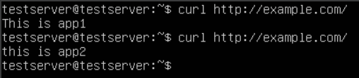

## Install nginx from source
- ssh to the server
- install ansible: `sudo apt install ansible`
- run ansible playbook to install nginx: `ansible-playbook nginx-install.yml --ask-become-pass`
## Run nginx as LB
- create two app2 to test load balancing functionality:

- Install docker: 

```bash
# Run the following command to uninstall all conflicting packages:
for pkg in docker.io docker-doc docker-compose podman-docker containerd runc; do sudo apt-get remove $pkg; done

# Update the apt package index and install packages to allow apt to use a repository over HTTPS:
sudo apt-get update
sudo apt-get install ca-certificates curl gnupg

# Add Docker’s official GPG key:
sudo install -m 0755 -d /etc/apt/keyrings
curl -fsSL https://download.docker.com/linux/ubuntu/gpg | sudo gpg --dearmor -o /etc/apt/keyrings/docker.gpg
sudo chmod a+r /etc/apt/keyrings/docker.gpg

# Use the following command to set up the repository:
echo \
  "deb [arch="$(dpkg --print-architecture)" signed-by=/etc/apt/keyrings/docker.gpg] https://download.docker.com/linux/ubuntu \
  "$(. /etc/os-release && echo "$VERSION_CODENAME")" stable" | \
  sudo tee /etc/apt/sources.list.d/docker.list > /dev/null

# Update the apt package index:
sudo apt-get update

# install docker engine,containerd and docker compose
sudo apt-get install docker-ce docker-ce-cli containerd.io docker-buildx-plugin docker-compose-plugin

# create docker group
sudo groupadd docker

# add user to docker group
sudo usermod -aG docker $USER

# activate group change
newgrp docker
```
- pull nginx image for running app1 and app2: `docker pull nginx`
- run app1: `docker run --name app1 -p 81:80 -d -v /home/testserver/example1:/usr/share/nginx/html nginx`
- run app2: `docker run --name app2 -p 82:80 -d -v /home/testserver/example2:/usr/share/nginx/html nginx`
- make sure both services are running: `docker ps`
- check out the curl response for app1 and app2: 
  
  

- create the following directories: `sudo mkdir -p /etc/nginx/sites-available/ /etc/nginx/sites-enabled/`
- update the nginx configuration file: `sudo nano /etc/nginx/nginx.conf` and update the following `include /etc/nginx/sites-enabled/*.*;`:
```nginxconf
worker_processes  1;

events {
    worker_connections  1024;
}

http {
    include       mime.types;
    default_type  application/octet-stream;

    sendfile        on;
    #tcp_nopush     on;

    #keepalive_timeout  0;
    keepalive_timeout  65;

    # add this line
    include /etc/nginx/sites-enabled/*.*;

}
```
- check nginx configuration syntax is correct: `sudo nginx -t` and restart the nginx service: `sudo systemctl restart nginx`
- create example.com: `sudo nano /etc/nginx/sites-available/example.com` and add the following content:
```nginxconf
server {
        listen 80;
        listen [::]:80;

        server_name example.com www.example.com;

        location / {
          proxy_pass http://example/;
        }
}

upstream example {
        server localhost:81;
        server localhost:82;
}
```
- create symlinks for example.com: `sudo ln -s /etc/nginx/sites-available/example.com /etc/nginx/sites-enabled/` and test nginx syntax: `sudo nginx -t`, if the syntax is okay then restart nginx service: `sudo systemctl restart nginx`
- add the following entry to ***/etc/hosts*** file: `0.0.0.0 example.com`
- use curl to check round robin load balancing capabilities:

  